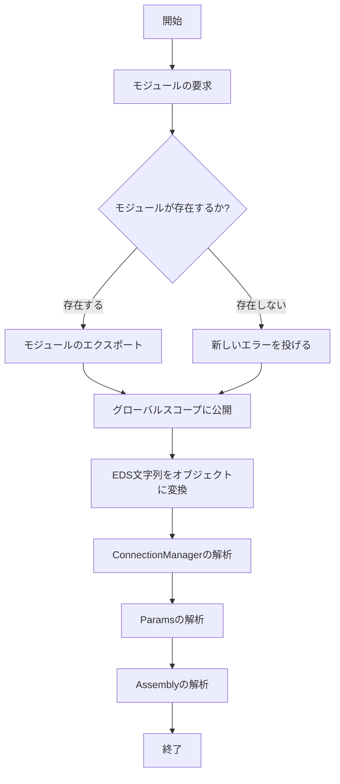

```mermaid
graph TD
    A[開始] --> B[モジュールの要求]
    B --> C{モジュールが存在するか?}
    C -- 存在する --> D[モジュールのエクスポート]
    C -- 存在しない --> E[新しいエラーを投げる]
    D --> F[グローバルスコープに公開]
    E --> F
    F --> G[EDS文字列をオブジェクトに変換]
    G --> H[ConnectionManagerの解析]
    H --> I[Paramsの解析]
    I --> J[Assemblyの解析]
    J --> K[終了]
```
